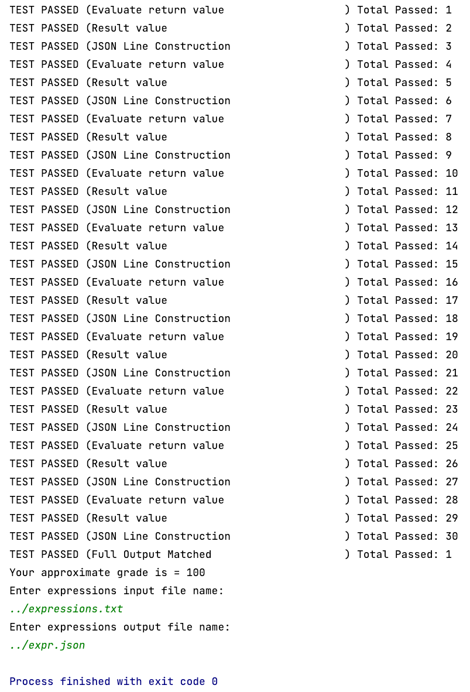
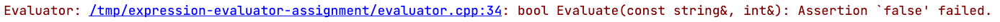

# LAB 1 - Evaluating Arithmetic Expressions

## Goal
Practice the methods offered by the C++ standard library string class by writing a C++ program that reads in an arithmetic expression evaluates the expression and finds the result of evaluation the expression. This lab will serve as practice and review of CSC 1230 topics as string class and methods, and file input/output.

## Sample Run

Here's a screenshot of a sample run:



The main program will do the following operations:
1. Calls the function `ValidateExpressions` on line 14. This function has been provided for you, and it will test the two functions that you need to implement for this lab. When the function is done, it is going to return a number that represents how many points out of one hundred you get for your tests. This will be most of your lab grade.
2. After the validation part you will write code to:
   1. Read from the keyboard the name of an input file, and then a name of an output file.
   2. Open the input file, report if there was an error (like file not found), if not continue.
   3. For each line on the input file (each line contains an arithmetic expression), you will evaluate the line and output a JSON line into the output file.

Note that since the program is running from the `cmake-build-debug` directory to open a file from the directory where your source code is you will need to write `../` before the filename. **DO NOT HARDCODE THIS INTO YOUR PROGRAM**. Notice how in the sample run, at the end, the name of the files are: `../expressions.txt` and `../expr.json` for the input and output file names respectively.

## Files you are given
In this lab, you are given all the files you will need for your CLion project.

* **CMakeLists.txt** - This contains the information necessary to build the project.  This file should not be modified.

* **main.cpp** – This file has been started for you, it initially contains a call to `ValidateExpressions`, but you are expected to add code below to read a file that contains arithmetic expressions on every line, and then output the result of those arithmetic expressions into a JSON file.

* **evaluator.h** – This file has been completed for you .  It declares the functions `Evaluate` and `CreateJSONLine`.  This file should not be modified.

* **evaluator.cpp** – This file contains a skeleton of the functions `Evaluate` and `CreateJSONLine`. It’s your job to fill the missing parts of the file
  * The header comment for the file,
  * The function implementation.
  * Any other functions that you may need, remember to include the header comments to the other functions.
  * Once you start working on the functions remember to remove the `assert` statements and to return the appropriate values.
* **test_scripts.h** - This file contains the declaration of the function used to test your code. This file should not be modified.
* **test_scripts.cpp** - This file contains the implementation of the function used to test your code. This file should not be modified. 

The starter project does compile, and you can produce an executable, but the executable will assert after you enter an arithmetic expression to remind you that the function `Evaluate` is not implemented.  You will want to remove the assert statements when you implement the functions.




## What the function `Evaluate` should do

The function declaration is as follows:
```c++
bool Evaluate(const string& expression, int& value);
```

When passed an arithmetic expression as a string (`expression`) containing numbers and the binary operators `+`, `-`, `*`, `/`, and `%`, it will return a boolean value indicating if the expression was valid or not. If the expression was valid, the function will set the parameter `value` to what the expression evaluates to. If the expression was not valid, it will set the parameter `value` to zero.

Examples:
```c++
int v;
bool ok =  Evaluate("2+3+4", v);
```
The previous example would assign `true` to `ok` and `v` would have the value `9`.

```c++
int v;
bool ok =  Evaluate("2+3*4", v);
```
The previous example would assign `true` to `ok` and `v` would have the value `14`. Note that the multiplication is evaluated first.

```c++
int v;
bool ok =  Evaluate("2+3+4a", v);
```
The previous example would assign `false` to `ok` and `v` would have the value `0`. Note that the expression is not valid!

### A Recommendation about how to implement `Evaluate`
You may want to implement the `Evaluate` function using a loop. The loop would start looking for multiplication operators (*, / and %) and would change one operation at a time, once there were no more multiplication operations, it would go and do the addition operations (+ and -). The loop will continue until it is left with a number or with an invalid string.

Examples

Evaluating `2+5*3-1`
```
Step 1:     2+15-1
Step 2:     17-1
Step 3:     16      Finished
```
Evaluating `4*5+10/2-1`
```
Step 1:     20+10/2-1
Step 2:     20+5-1
Step 3:     25-1
Step 4:     24      Finished
```

Evaluating `12+3*3-4a`
```
Step 1:     12+9-4a
Step 2:     21-4a   Finished
```

Note that the third example did not end on a number! So, the expression was not valid.

Some points to consider:

* You are NOT supposed to handle a unary minus sign (or unary plus sign for that matter).  Just ignore it `–` for instance the expression `-2` would evaluate `-2`.
* Characters appearing in the string that are neither digits nor one of the operators `+`, `-`, `*`, `/`, and `%` are to be ignored.  Just perform the operations that can be performed, and leave any other character where it is:
```
2+3+(5**2)A2 --> 5+(5**2)A2 No more simplification can be done!
```
* The only situation where your function will be allowed to generate an exception (i.e. crash) is division by zero.  No points will be deducted if the program crashes in this situation.

•	Do NOT try to “improve” on the above specification so that the output produced deviates from what is described above.  That will mean your program fails our testing, and you will lose correctness points.

## What the function `CreateJSONLine` should do

The function declaration is as follows:
```c++
string CreateJSONLine(const string& expression, int result, bool error);
```

This function takes in an arithmetic expression, the result of that expression (you'd need to have called `Evaluate` to know this value!) and a boolean indicating whether there was an error or not.
Examples:
```c++
string json = CreateJSONLine("2+3+4", 9, false);
```
The previous example would create a JSON line as follows:
```json
{"expr":"2+3+4", "result":9, "error":false}
```
The line indicates the original expression ("2+3+4"), the value that that expression evaluates to (9), and the error value that in this case is (false).

```c++
string json = CreateJSONLine("2+3*4", 9, false);
```
The previous example would create a JSON line as follows:
```json
{"expr":"2+3*4", "result":14, "error":false}
```
The line indicates the original expression ("2+3*4"), the value that that expression evaluates to (14), and the error value that in this case is false.


```c++
string json = CreateJSONLine("2+3+4a", 0, true);
```
The previous example would create a JSON line as follows:
```json
{"expr":"2+3+4a", "result":0, "error":true}
```
The line indicates the original expression ("2+3+4a"), the value that that expression evaluates to (0), and the error value that in this case is true, note that this expression cannot be evaluated.


## Some expectations for how you write your functions

If you do not follow these expectations, you may have points deducted from your lab grade.

1.	_Good design_

> Your functions could be implemented with one single humongous, complicated single function, but you should NOT pursue that approach.  As you look at the problem, you will see that you will need to repeat some very similar logic two times because the five different operators cannot be handled at the same time.  You need to deal with `*`, `/`, `%` first, and then deal with `+`, `-`.  You SHOULD design a sub-function that you can call once for `*`, `/`, `%`, and then for `+`, `-`.   If you do this, the actual code for your functions can be relatively short, and very easy to understand.
>
>This sub-functions will likely involve a loop.  Inside the loop will be a complicated set of logic.  If you were to leave it as one function, it would still be complicated and difficult for another person to read.   You should move this inner logic into a second sub-function, so you have a clean loop that is easy to read.
>
> This kind of refinement is an important skill that needs to be developed.  “Clean”, understandable logic is essential so other programmers can understand your code, and verify it is correct.
> 
> Since you will be creating a couple sub-functions, make sure any `string` parameters are passed by reference.  If a `string` parameter is not to be modified by the function, be sure to declare it `const`.

2.	_Use of `string` methods_

> One of the goals of this assignment is to learn how to use the methods of the `string` class.  Therefore, you must *use* them!  If you find yourself writing a loop to concatenate a lot of characters to the end of a string, to search for the position where a character occurs, or to replace some text in a string with some different text, you are doing something wrong. Try to avoid using the `[]` operators on string or the `at` method of string.
> 
> It is expected that you will make one or more uses of each of the following `string` class methods. See [C++ Reference](http://www.cplusplus.com/reference/string/string) for more information on the `string` class methods.

* `string` fill constructor
* `find_first_of` method
* `replace` method
* `substr` method

3.	_Other C++ library functionality you should take advantage of_

>   It is also expected that you will use the following
* `isdigit`   function  
* `stoi` function
* `stringstream` class


4.	_Style_
>    Your program needs to be orderly and readable. If you are working a development team and don’t write clean looking code, you will be unpopular among your colleagues and may not work on that team very long.  Because of this your program will be graded on style as well as correctness.  Please refer to the style guidelines discussed in class and in reading assignments concerning

* Indention of code
* Consistent use of {}
* Meaningful names of identifiers
* Naming conventions for identifiers (camelCase for variables, CamelCase for function names. First word of a function name typically should be a verb.)
* No use of global variables. Global variables sometimes are appropriate, but not in the assignments we will be giving this quarter.
* Making sure object parameters are passed by reference (and declared const if appropriate)
* Any other programming practices discussed in class and that appear in the Canvas site of the class.

5. _Documentation_

> At the start of your file you should have a header comment that gives the title of the assignment, the purpose, and your name.  Here is an example of what that could look like:

```c++
/*
  Title:    Lab 1 – evaluator.cpp
  Purpose:  implement the Evaluate and CreateJSONLine functions 
            called by the main program to generate the JSON file
            with the evaluation of arithmetic expressions.
  Author:   Sally Johnson
  Date:     January 6, 2020
*/
```
> Each subordinate function should also start with a header that describes what it does, its parameters, what it returns, and how errors are handled.  Note that these comments start with a description of what the function does, then it explains each of the parameters, and lastly it explains what the return value is going to be. Here is an example:
```c++
/**
 *  Creates a JSON line given the expression that was been evaluated, the value that
 *  resulted from the evaluation and whether there was an error or not.
 *  Given the following function call:
 *  CreateJSONLine("2+5*3", 17, false)
 *  The resulting JSON (the string returned by the function) would be:
 *  {"expr":"2+5*3", "result":17, "error":false}
 * @param expression The arithmetic expression that was recently evaluated
 * @param result the result of executing the arithmetic expression
 * @param error indicates whether or not the expression wasn't valid, and therefore unable to be
 *              evaluated.
 * @return a JSON string containing the fields: expr, result and error, set with the values sent
 *          as parameter.
 */
```
>You should include additional comments in your code to describe what you are doing.   If it is hard to understand what a variable is for, add a comment after it.   It is possible, though, to put in too many comments, so be judicious and make sure you have time left to do well in your other classes when it comes to commenting.

## Submitting your code
Your solution should be contained within a single C++ file, and that file must be named `evaluator.cpp`. File names are case-sensitive!

Make sure you test your code thoroughly.  We will run a series of tests on your function, and the strings you return must match character by character what is specified above.

Your code needs to be submitted through GitHub.  You will need to **push** your last version of your program before the lab deadline. As a good programming practice remember to commit frequently and to push every time you have a functioning version of your code.

## Grading
Correctness is essential.  Make sure your solution builds as described above and correctly passes all 30 tests, and the last test of producing the complete output file. We could test on other input values as well. Your code must compile and should not have runtime errors (crash), except for the division by zero runtime error.

Even if your solution operates correctly, points will be taken off for:
- Not following the design described above
- Not adhering to style guidelines described above
- Using techniques not presented in class
- Programming error not caught by other testing
- Not following good programming practices

## Academic Integrity
This programming assignment is to be done on an individual basis. At the same time, it is understood that learning from your peers is valid, and you are encouraged to talk among yourselves about programming in general and current assignments in particular.  Keep in mind, however, that each individual student must do the work in order to learn.  Hence, the following guidelines are established:
- Feel free to discuss any and all programming assignments but do not allow other students to look at or copy your code. Do not give any student an electronic or printed copy of any program you write for this class.
- Gaining the ability to properly analyze common programming errors is an important experience. Do not deprive a fellow student of his/her opportunity to practice problem-solving: control the urge to show them what to do by writing the code for them.
- If you’ve given the assignment a fair effort and still need help, see the instructor or a lab assistant.
- **If there is any evidence that a program or other written assignment was copied from another student or from any other source, the involved parties will receive a double zero penalty. This rule will be enforced.**
- Protect yourself: Handle throw-away program listings carefully, keep your repository private.

Refer to the ECS Department Policy on Academic Integrity that is included in the class syllabus.

## Grading Rubric Summary
The following aspects are going to be considered during grading. Make sure you comply with all of them.
- The program compiles (there will be **no partial credit** for programs that do not compile)
- Provides the correct output for the test cases
- Catches errors gracefully, the program does not crash on incorrect input, for instance if the user provides an input file that doesn't exist, your program should just report `Unable to open file`, and **not** crash.
- The program outputs the information **in the specified format**
- The assignment follows all the instructions
- In general the program does not crash (except in when you enter an expression that causes zero division)

*Most* of your grade will come from the value that the `ValidateExpressions` function returns, but there could be deductions due to the issues described above.
